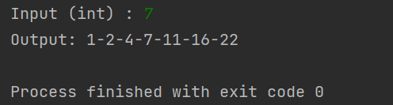
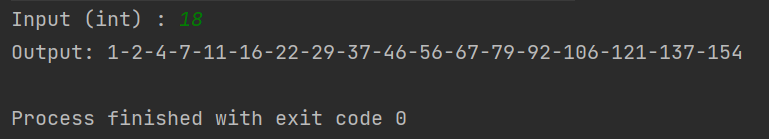
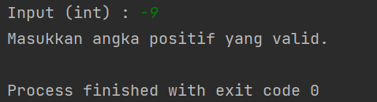
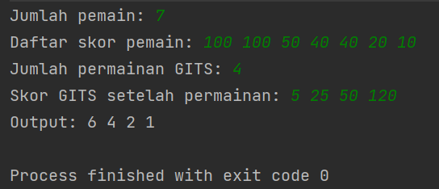
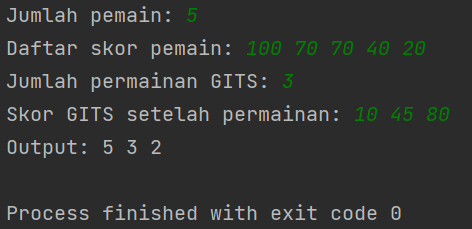
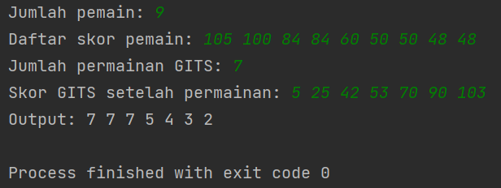
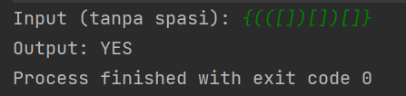
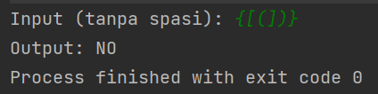
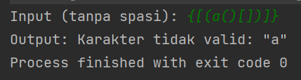
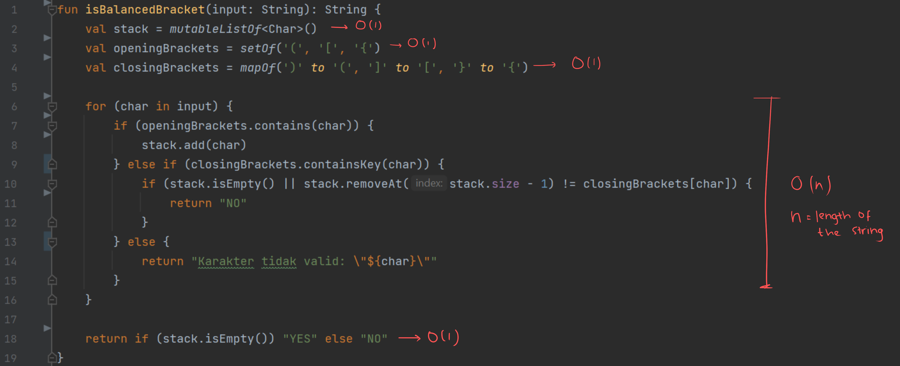

<h1 align="center">Problem Solving Test for Gits</h1>

## First Problem's (A000124 of Sloane’s OEIS) Result

## Second Problem's (Dense Ranking) Result

## Third Problem (Balanced Bracket)
### Result

### Time Complexity

Kompleksitas waktu saat pembuatan `stack`, `openingBrackets`, `closingBrackets`, dan `return` string memiliki kompleksitas waktu konstan O(1)

Untuk setiap karakter dalam string input, memiliki kompleksitas waktu yang konstan pula yakni O(1). Karena terdapat loop, dengan melakukan iterasi sebanyak `n` (panjang string input), maka kompleksitas waktu dari loop tersebut ada O(n).

Jadi, kompleksitas waktu dari fungsi `isBalancedBracket` adalah O(n), dimana n adalah panjang dari string input. 
